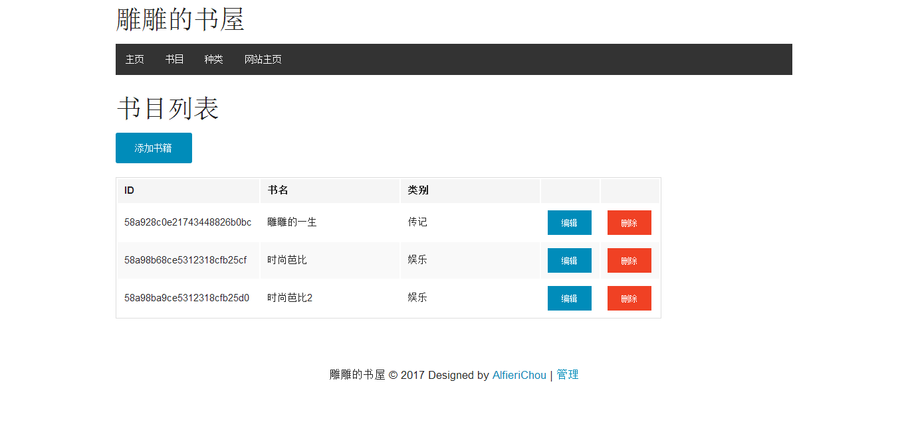
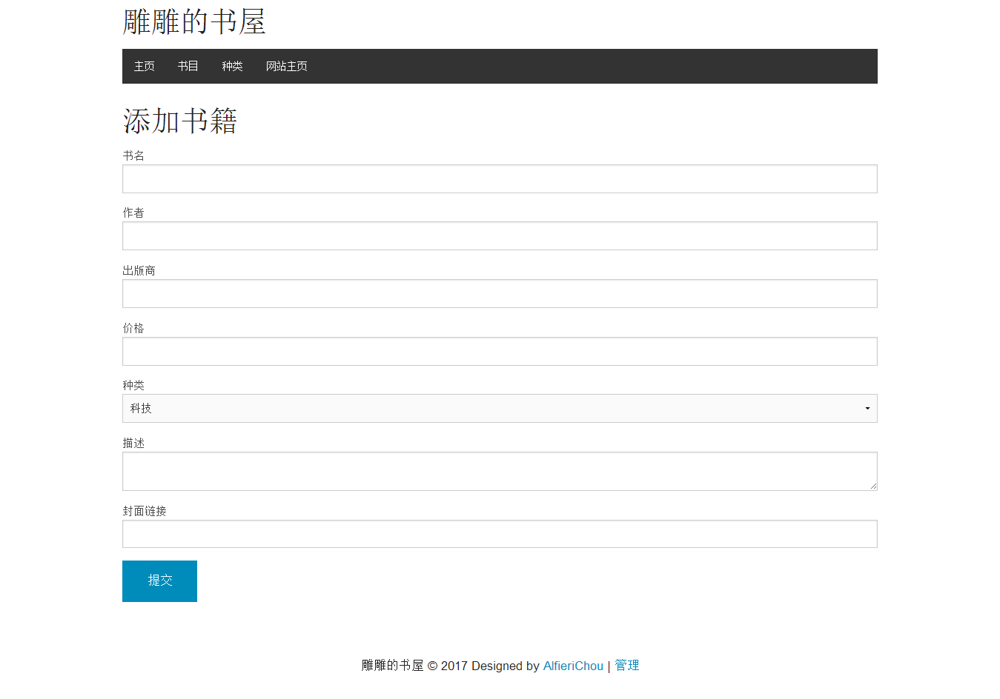
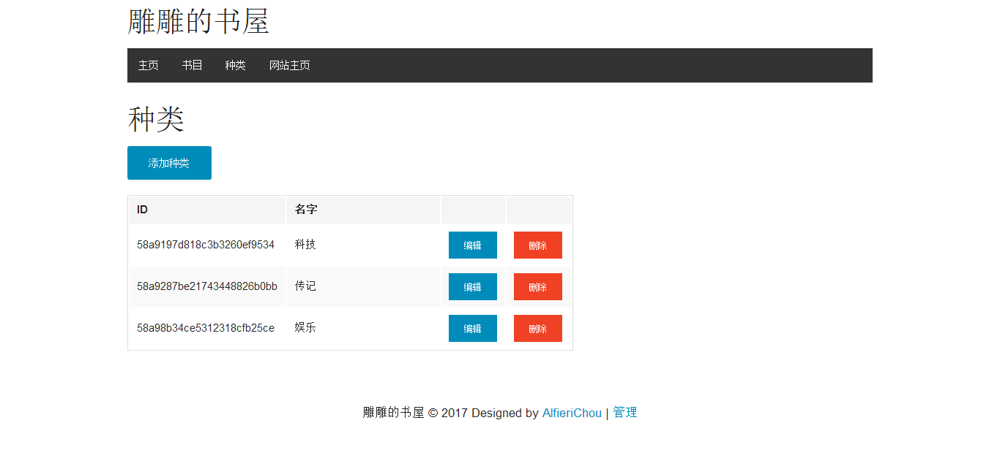

# bookStore
网上书店-带后台管理和购物车功能

## 前言 

* 很久以前就想开发一个类似购物网站的系统，但是，由于种种原因，一直搁置在那了。
* 这个项目是我在YouTube上面看到的，一开始我就产生了很大的兴趣，就想学完这个项目，但是现在那个分享的人已经被YouTube封号了。我当时写这个项目才写到差不多一半的时候，因为回家有点事，所以搁置在那了，等我后来没有事的时候，上YouTube上去找的时候，那个人已经被封号处理了，回想起来真是挺可惜的，他那上面有好几个项目的教程，我就学了这么一个，还没学完。诶！不过后来自己慢慢的摸索，总算是搞出来了。
## 项目实现后截图

1. 主页   

2. 关于   

3. 购物车   

4. 详情页   

5. 书目列表   

6. 添加书籍   

7. 分类页   

8. 添加分类   

## 运行环境

1. node.js
2. mongoDB
3. npm
4. 一个适合自己的编辑器 比如说（sublime，vscode,hbuilder,brackets...）

## 怎么启动这个项目

* git clone git://github.com/AlfieriChou/bookStore
* npm install
* npm start

## 说明

*  这个项目是基于PayPal所开发的kraken.js所完成的，前端采用foundation框架，为什么没用bootstrap，个人感觉foundation还简单一点代码量较bootstrap少一点。所以就选择了foundation。
*  这个项目我以后会更新，应为这个系统还没有添加管理员账号和用户登录注册还有用户管理功能。我以后会继续完善这个系统。
